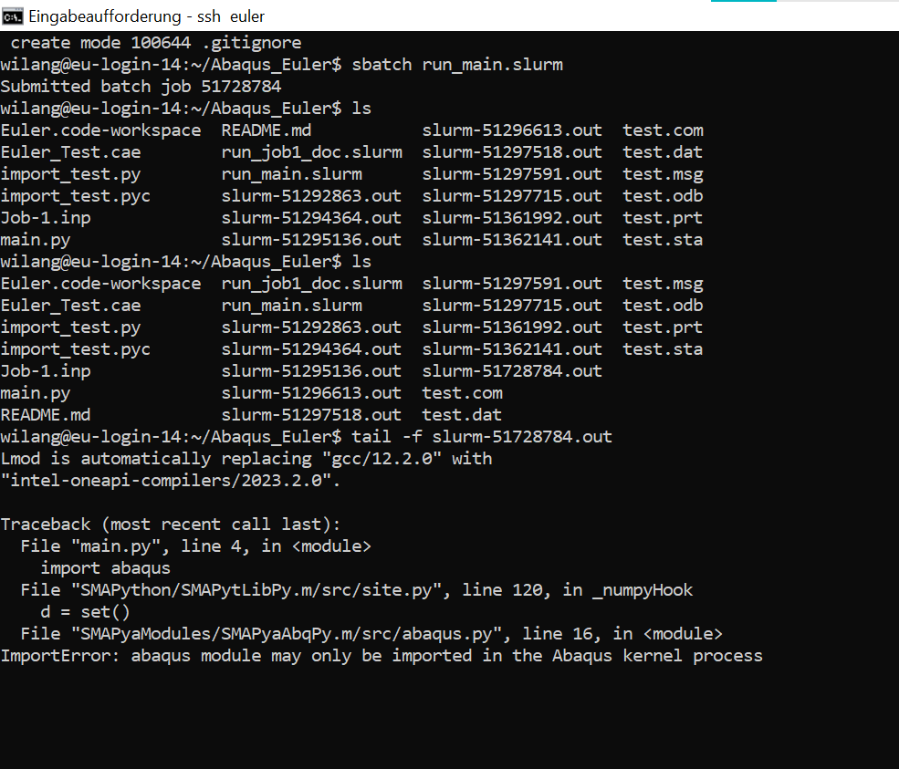

# Abaqus_Euler
Should run Abaqus on Euler HPC.

- Running on windows works

- Running on Euler with abaqus imports active leads to following error:
    

- Turning off these abaqus imports: 

does not cause any errors but nothing seems to happen. When inspecting the slurm out file this appears:
    
